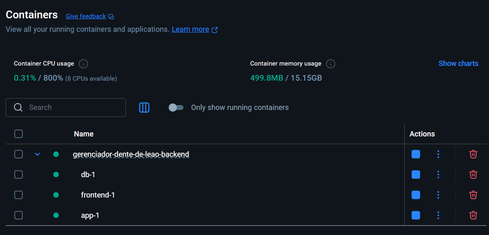
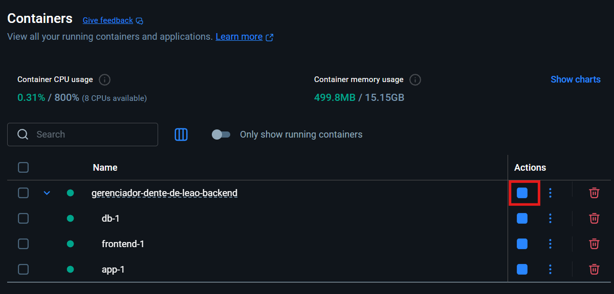
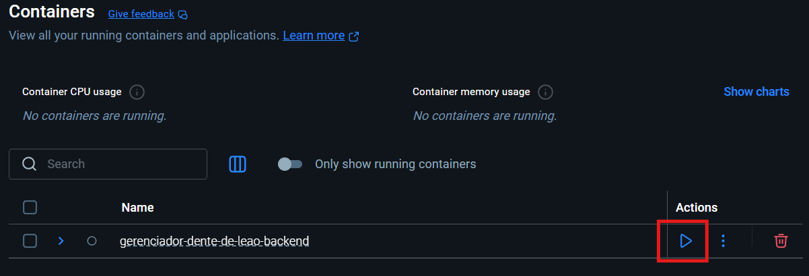

# Como Rodar o Projeto Localmente com Docker

Este guia descreve os passos necessários para configurar e rodar o projeto "Gerenciador Dente de Leão" em seu ambiente de desenvolvimento local usando Docker.

## Pré-requisitos

Para rodar este projeto, você precisará ter o Docker e o Docker Compose instalados em sua máquina. A maneira mais fácil de obter ambos é instalando o **Docker Desktop**.

### 1. Baixando e Instalando o Docker Desktop

O Docker Desktop é um aplicativo para Mac, Windows ou Linux que permite construir e compartilhar aplicações e microsserviços em contêineres.

- **Download**: Baixe o Docker Desktop no site oficial: [https://www.docker.com/products/docker-desktop](https://www.docker.com/products/docker-desktop)

- **Instalação**: Siga as instruções de instalação para o seu sistema operacional.
    - **Windows**: Pode ser necessário habilitar a virtualização (WSL 2) na BIOS do seu computador. O instalador do Docker Desktop geralmente o guiará por esse processo se necessário.
    - **Mac/Linux**: A instalação costuma ser mais direta.

Após a instalação, abra o Docker Desktop para garantir que o motor do Docker esteja em execução.

## Configuração do Ambiente

Com o Docker em execução, o próximo passo é configurar os arquivos do projeto.

### 1. Arquivo `docker-compose.yml`

O arquivo `docker-compose.yml` é o coração da configuração local. Ele define os serviços que compõem sua aplicação (backend, frontend e banco de dados) para que possam ser executados juntos em um ambiente isolado.

Este arquivo já está presente na raiz deste repositório. Você não precisa criá-lo, apenas garantir que ele esteja atualizado com a versão mais recente do `main` branch.

## Executando o Projeto

Com o Docker em execução e o arquivo `docker-compose.yml` no lugar, você pode iniciar a aplicação com um único comando.

### 1. Subindo os Contêineres

Abra um terminal na raiz do projeto (na mesma pasta onde o arquivo `docker-compose.yml` está localizado) e execute o seguinte comando:

```bash
docker-compose up -d
```

- `docker-compose up`: Este comando cria e inicia os contêineres definidos no arquivo `docker-compose.yml`.
- `-d` (ou `--detach`): Executa os contêineres em segundo plano (modo "detached"). Isso libera seu terminal e permite que os contêineres continuem rodando.

Na primeira vez que você executar este comando, o Docker fará o download das imagens necessárias (PostgreSQL, backend e frontend), o que pode levar alguns minutos dependendo da sua conexão com a internet.

Após a conclusão, serviço estará disponível no seguinte endereço:
- **Gerenciador dente de leão**: `http://localhost:8081`

Após a execução, você pode abrir o Docker Desktop para ver o status dos seus contêineres. Eles estarão agrupados sob o nome do projeto (geralmente o nome da pasta, `gerenciador-dente-de-leao-backend`).




### 2. Parando os Contêineres

Para parar todos os contêineres relacionados ao projeto, execute o seguinte comando no mesmo diretório:

```bash
docker-compose down
```
Este comando para e remove os contêineres e a rede criada pelo `docker-compose up`. O volume do banco de dados (`db-data`) não é removido por padrão, então seus dados persistirão entre as execuções.

Você também pode parar os contêineres pelo Docker Desktop, selecionando o grupo de contêineres do projeto e clicando no botão de "stop".



## Gerenciando os Contêineres

Depois que os contêineres foram criados pela primeira vez com `docker-compose up`, você não precisa rodar o comando `up` novamente para iniciar tudo. Você pode facilmente iniciar e parar o ambiente usando o Docker Desktop.

### 1. Iniciando e Parando Contêineres com Docker Desktop

Esta é a maneira mais simples de gerenciar seus contêineres no dia a dia.

1.  Abra o Docker Desktop.
2.  Na aba **Containers**, você verá o grupo de contêineres do projeto (ex: `gerenciador-dente-de-leao-backend`).
3.  Você pode usar os botões de "play" e "stop" para iniciar ou parar todo o grupo de uma só vez.


*Descrição da imagem: Tela do Docker Desktop com foco no grupo de contêineres do projeto, destacando o botão de "play" para iniciar o grupo que está parado.*

### 2. Gerenciando via Linha de Comando (Avançado)

Se preferir usar o terminal, você pode usar os seguintes comandos:

- **Para iniciar todos os serviços definidos no `docker-compose.yml` que estão parados:**
  ```bash
  docker-compose start
  ```

- **Para parar todos os serviços sem remover os contêineres:**
  ```bash
  docker-compose stop
  ```

- **Para reiniciar os serviços:**
  ```bash
  docker-compose restart
  ```
Isso é útil para aplicar alterações de configuração que não exigem a reconstrução da imagem.
